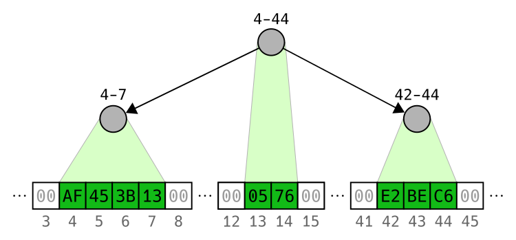

# haskell-sparse-blob

Sparse BLOB data structure written in Haskell.

Simply stated, a Binary Large OBject (BLOB) is a vector of bytes. A *sparse* BLOB contains large segments containing only zeros. The data structure does not store the zeros, which saves memory.

## Rationale

The main motivation for writing this library is for representing *static program memory* in program ASTs and definitional interpreters.

Typical alternatives:
* Lists - Lookup and modification is very slow (*O(n)*)
* `IntMap` - Reasonable alterative; albeit has greater memory use and slow range-extraction. (See benchmarks)
* `ByteString` - Reasonable alternative. However, may contain much zero-filled memory (e.g., when the program heap grows upward from `0x00000000` and the stack downward from `0xFFFFFFFF`).

For *dynamic memory* (which is frequently updated), a `IntMap` (possibly overlayed) may be preferable.

## Example

```haskell
import qualified Data.ByteString as BS
import           Data.SparseBlob

main :: IO ()
main =
  do
    xs <- BS.readFile "input_file"
    let fileSize = BS.length xs
        off1     = 0
        off2     = 2*1024*1024*1024 -- 2 GiB
        -- Write the file contents to two distant offsets within the BLOB
        blob     = insertRange off2 xs $ insertRange off1 xs empty
    -- Extract from one offset and write to a file
    BS.writeFile "output_file" (lookupRange off2 fileSize blob)
```

## Implementation Intuition

Non-zero regions of bytes are stored in an AVL tree, which is a self-balancing binary search tree. This representation ensures individual bytes can be quickly accessed. Zeros are represented by gaps between ranges.



## License
BSD-3 - See the `LICENSE` file
